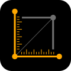
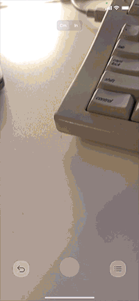

# MySimpleRuler

This application is a simple way to measure the objects which locating around you.

## Description

1. Take your phone and come closer to the measured object.
2. Tap on the screen and put the points. The line between points will be the distance in centimeters or inches.
3. You can switch between centimeters and inches using segment control on top of the screen.
4. While measuring you can take a snapshot using the circle button locates at the bottom center of the screen.
5. To check all measurements that you made, use the list button (right below).
6. If you want to undo the last measurement, use the button undo (left below).
